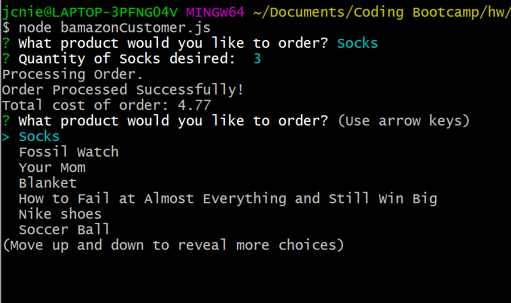
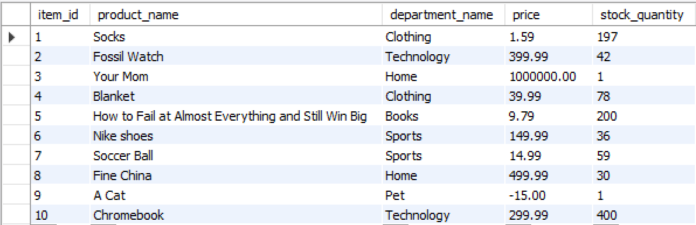

# Bamazon

An example of interaction between a MySQL database and Node.js

The customer interface allows the user to order from a database which then updates its value accordingly.

The program returns to the main menu after each successful/unsuccesful order after providing feedback.

# Basic Functionality (Sufficient Stock)

### Database before and after processing
Before

After

# Basic Functionality (Insufficient Stock)

### Database before and after processing
Before

After

